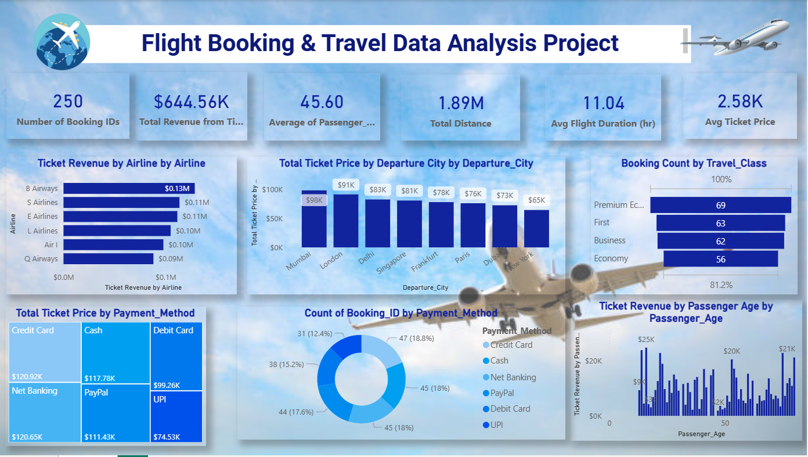

# ✈️ Flight Booking & Travel Data Analysis Dashboard

An interactive **Business Intelligence dashboard** designed to extract actionable insights from flight booking data. This project demonstrates end-to-end data analytics skills — from data cleaning to visualization and storytelling — using real-world travel data.

---

## 📌 Project Overview

This dashboard transforms raw flight booking data into meaningful insights to support **data-driven decision-making in the aviation industry**. It focuses on uncovering trends in revenue, customer behavior, and operational performance.

---

## 🚀 Key Highlights

* 📊 Built an interactive dashboard using **Power BI**
* 🔍 Performed data cleaning and transformation for accuracy
* 📈 Designed insightful visualizations for business understanding
* 🧠 Applied **DAX** for advanced calculations and metrics
* 📉 Delivered actionable insights from complex datasets

---

## 📸 Dashboard Preview

  

---

## 📊 Key Metrics

| Metric                 | Value     |
| ---------------------- | --------- |
| Total Bookings         | 250       |
| Total Revenue          | $644.56K  |
| Avg Passenger Age      | 45.60 yrs |
| Total Distance Covered | 1.89M km  |
| Avg Flight Duration    | 11.04 hrs |
| Avg Ticket Price       | $2.58K    |

---

## 📈 Insights & Analysis

### ✈️ Revenue Analysis

* Identified top-performing airlines contributing the highest revenue
* Compared airline-wise ticket sales for performance benchmarking

### 🌍 Location-Based Trends

* Analyzed **departure city performance**
* Identified cities generating the highest ticket revenue

### 🧳 Travel Class Insights

* Premium Economy and First Class show strong booking trends
* Economy still maintains a consistent customer base

### 💳 Payment Behavior

* Credit Card and Net Banking dominate transaction methods
* UPI adoption is growing but still lower in comparison

### 👥 Customer Demographics

* Middle-aged passengers (40–60 years) contribute significantly to revenue
* Revenue distribution varies across age groups

---

## 🛠️ Tech Stack

* **Power BI** – Dashboard creation & visualization
* **DAX** – Data Analysis Expressions
* **Data Modeling** – Relationship building
* **Data Cleaning & Transformation**

---

## 📂 Data Source

* Dataset sourced from **Kaggle** (used for educational purposes)

---

## 🎯 Project Objective

To showcase strong capabilities in:

* Data Analytics
* Business Intelligence
* Data Visualization
* Insightful Storytelling

This project highlights how data can be leveraged to generate **strategic business insights** in the travel and aviation domain.

---

## 💡 What Makes This Project Stand Out

✔ Clean and intuitive dashboard design
✔ Strong storytelling through data
✔ Business-focused insights
✔ Real-world dataset application
✔ End-to-end analytics workflow

---

## 📬 Let's Connect

If you're a recruiter or hiring manager looking for someone skilled in **data analytics and BI**, feel free to connect or reach out!

---
